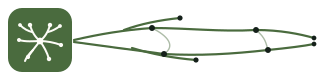

<p align="center">
  
</p>

<h1 align="center">Mycelium</h1>

<p align="center">
  <strong>The forest of memory.</strong><br/>
  A personal work hub where tasks, notes, time, clients/projects and
  invoicing share one tenant — and where archived knowledge decomposes
  into atoms that fertilise the next thought. Every surface is also a
  first-class MCP control surface, so an AI agent can drive the whole
  system exactly like the web UI.
</p>

<p align="center">
  <a href="https://github.com/angleto/mycelium/actions/workflows/ci.yml"></a>
  <a href="LICENSE"></a>
  
  <a href="https://github.com/astral-sh/ruff"></a>
  <a href="https://mypy-lang.org/"></a>
  
  
</p>

---

Mycelium unifies a task manager, a time tracker, a scheduler, notes with a
hierarchical memory and semantic retrieval, clients/projects,
configurable workflows, and Italian electronic invoicing (SDI). Every
surface is also exposed over **MCP**, so an AI agent can drive the whole
system exactly like the web UI.

## What makes Mycelium different

Most knowledge tools keep your notes intact and let them sediment until
you can't find anything. Mycelium treats memory like a forest floor: the
things you finish thinking about don't disappear, they **decompose**
into smaller, embedded atoms (claims, definitions, examples, decisions)
that retrieval and the link graph can recompose into new ideas. Tags
and citations are the mycelium that joins atoms across notes; the LLM
side of Mycelium is wired to *traverse* that mycelium, not to summarise
your notes into yet another opaque blob.

Three commitments fall out of this:

- **One tenant, one substrate.** Tasks, notes, time, clients, invoices
  and memory share the same RLS-scoped workspace, so an atom from a
  three-year-old transcript can ground today's task without a copy.
- **Decomposition over summary.** Long notes are paragraph-chunked at
  index time and a per-turn chunker covers conversations; retrieval
  hits the exact paragraph (with `chunk_index` + `ts_headline`), not
  the whole document. The user can promote any chunk into a typed
  link or a derived task without losing provenance.
- **Agents on the same footing as the user.** The web UI, the CLI,
  the Neovim plugin, an MCP client and the internal Telegram assistant
  all dispatch through the same RBAC + RLS surface. Unified search
  (`task_search.search_unified`) is a tool both humans and LLMs hold.

## Highlights

- **Workspaces with real RBAC.** Each workspace is an isolated tenant
  (PostgreSQL row-level security). Roles are sudo-style: you act as a
  normal *user* by default and explicitly switch up to *owner* (or, for
  the platform operator, *admin*) only when you need to. A member added
  later can never eject the workspace owner; no cross-workspace leakage.
- **Notes → tasks.** Every note belongs to a client (default
  "Personal"); convert a note to a task or spin a task off a text
  selection, inheriting tags.
- **Tasks with structure.** Per-task checklist (indexed in search),
  Eisenhower importance/urgency as mandatory axes with priority
  derived from them, MoSCoW necessity (must / should / could / wont).
- **Time &amp; billing on the client.** Hourly rate and billable default
  live on the client; every task resolves to a project and a client.
- **Clients &amp; projects, workflows, invoicing**, tag scoping, a
  dependency graph, scheduler, email-to-task, notifications.
- **Italian e-invoicing, both ways.** Outbound (active) cycle to SDI
  and an inbound (passive) router that ingests received invoices.
- **MCP server** (100+ tools) mirroring the API for agent control.
- **Keyboard-first CLI + Neovim plugin.** `brew install
  angleto/mycelium/mycelium-cli` for the terminal client (`mycelium today`, `flow
  task add`, `mycelium timer start`, `mycelium note voice`, …) and
  [`nvim/mycelium-nvim`](nvim/mycelium-nvim/README.md) for the in-editor
  surface. Both shell out to the same REST API; see
  [`docs/cli.md`](docs/cli.md). CLI and nvim plugin track Mycelium tags
  one-for-one (currently `v2.0.x`).
- **Tested.** Backend pytest + a Playwright end-to-end suite.

## Stack

Python (FastAPI, SQLAlchemy async, Alembic) · PostgreSQL + pgvector ·
Redis · React + TypeScript + Vite · uv workspace · MCP.

## Quick start (local dev)

Prereqs: Docker, [uv](https://docs.astral.sh/uv/), Node + pnpm.

```
# 1. infra (Postgres + Redis)
make up
MYCELIUM_DB_APP_PASSWORD=flow_app make db-bootstrap
make migrate

# 2. an admin account
MYCELIUM_ADMIN_EMAIL=you@example.com MYCELIUM_ADMIN_PASSWORD='a-strong-pass' \
  uv run python -m mycelium_core.bootstrap_admin

# 3. backend (API)
MYCELIUM_JWT_SECRET=... MYCELIUM_SECRET_KEY=... make run-api

# 4. frontend
cd web && pnpm install && pnpm dev
```

Backend tests: `make test`. End-to-end (servers up + a seeded
account): `cd web && pnpm e2e`.

Architecture, domain model, decisions and ADRs live in
[`docs/`](docs/README.md).

## Versioning

The active development line is **`v2.0`** (also the default branch).
Compared to the v1.x line, v2.0 collapses 104 incremental Alembic
revisions into a single baseline (see
[`docs/migrations.md`](docs/migrations.md)): new installs run one
migration instead of the full historical chain. v1.x branches and
tags have been retired from the remote; the user-facing summary of
what shipped in v2.0 is at
[`docs/release-notes-v2.0.md`](docs/release-notes-v2.0.md).

## License

Mycelium is dual-licensed:

- as **free software** under the **GNU Affero General Public License
  v3.0 or later** (`AGPL-3.0-or-later`), with the attribution
  requirement set out in the [`NOTICE`](NOTICE) file under AGPLv3
  section 7(b). Any redistribution, fork, hosted instance, or
  derivative work must preserve the "Based on Mycelium" attribution in
  user-visible locations (About / Version / startup banner /
  interactive network interface / documentation). If you run a
  modified version to provide a network service, AGPL section 13
  also requires you to offer the corresponding source to its users.
- under a separate **commercial license** for parties who cannot or
  do not wish to comply with AGPL section 13 (network-use source
  disclosure) or the section 7(b) attribution requirement. Contact
  angelo@leto.blue for terms.

See [`LICENSE`](LICENSE) and [`NOTICE`](NOTICE) for the full text.

SPDX-License-Identifier: AGPL-3.0-or-later

## Trademark

"Mycelium" and the Mycelium logo are trademarks of Angelo Leto. Neither the
AGPL grant nor the section 7(b) attribution requirement grants
permission to use the project name or logo beyond the descriptive
"Based on Mycelium" attribution. Forks and derivative distributions must
be released under a different name and a different mark. You may
describe your project as "based on Mycelium" or "compatible with Mycelium",
but you may not redistribute it under the "Mycelium" name, nor use the
logo, in a way that would suggest endorsement by or affiliation with
the upstream project. See [`NOTICE`](NOTICE) for full terms and
contact details for trademark permission requests.

Contributions to the upstream project must be signed off under the
[Developer Certificate of Origin](CONTRIBUTING.md#developer-certificate-of-origin-dco)
**and** submitted under the [Mycelium Contributor License Agreement](CLA.md).
